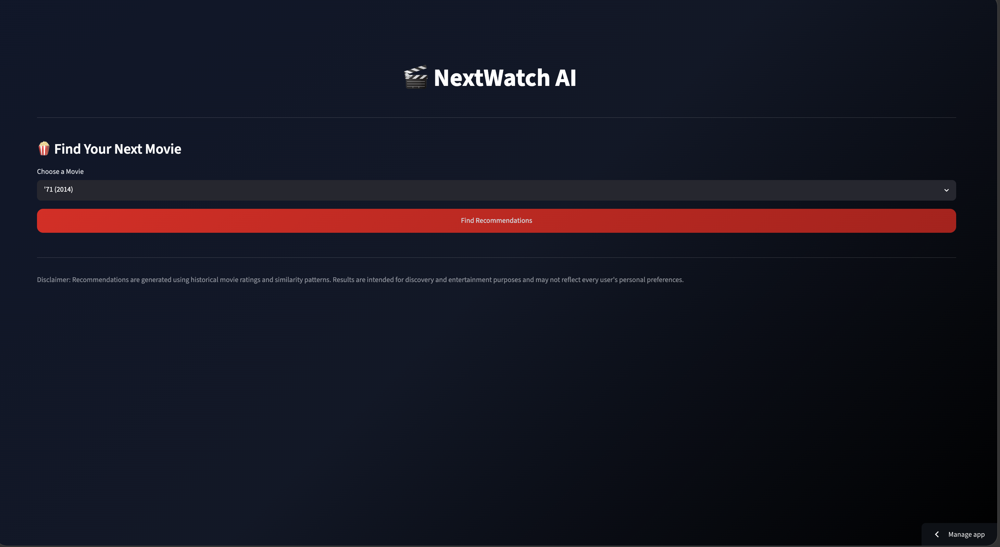
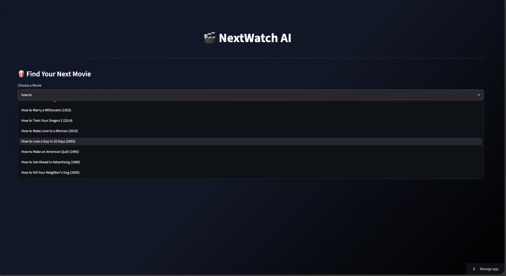
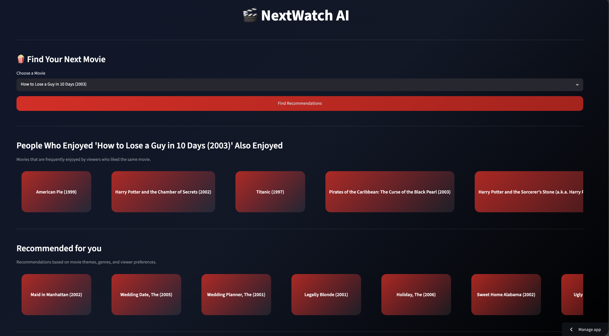

# NextWatch AI: Movie Recommendation System

<p align="left">
  
  
  
  
  
</p>

NextWatch AI is a machine learning-powered movie recommendation system designed to enhance content discovery. By analyzing historical user rating data, the application generates relevant movie recommendations using collaborative filtering, matrix factorization, and hybrid recommendation techniques.

<table>
<tr>
<td></td>
<td></td>
<td></td>
</tr>
<tr>
<td align="center">Home Page</td>
<td align="center">Search Movie</td>
<td align="center">Recommendations</td>
</tr>
</table>

---
### Problem Statement

The rapid growth of online movie catalogs has created significant challenges in content discovery. Recommendation systems play a critical role in helping users navigate large collections by identifying content that aligns with their preferences.

This project explores multiple recommendation techniques, including collaborative filtering and matrix factorization, to generate personalized movie recommendations from historical user rating data.

---

### Exploratory Data Analysis

Key findings from the dataset:

* Ratings are concentrated between 3 and 5.
* Movie popularity is highly skewed.
* User activity varies significantly.
* The user-movie matrix is highly sparse.
* Collaborative filtering is well-suited for this type of data.

---
#### **Item-Based Collaborative Filtering**

Two similarity-based recommendation approaches were evaluated:

* **Pearson Correlation** — Measures relationships between movie rating patterns.
* **Cosine Similarity** — Measures similarity between movie rating vectors.

##### Evaluation Results

| Method              | Runtime (s) | Diversity |  RRR |
| ------------------- | ----------: | --------: | ---: |
| Pearson Correlation |      0.0018 |        63 | 0.54 |
| Cosine Similarity   |      0.0007 |        49 | 0.85 |

**Selected Model:** Cosine Similarity

Cosine Similarity achieved the best overall performance, providing faster recommendations and a higher Reciprocal Recommendation Rate while maintaining good diversity.

---

#### Matrix Factorization

A TensorFlow-based Matrix Factorization model was implemented to learn latent user and movie features and predict ratings for unseen user–movie pairs.

##### RMSE Evaluation

| Model                  |   RMSE |     
| ---------------------- | -----: |
| Movie Average Baseline | 0.9157 |
| Matrix Factorization   | 0.8352 |

Matrix Factorization reduced prediction error by **8.8%** compared to the baseline model.
| Metric     |  Score |
| ---------- | -----: |
| Train RMSE | 0.7699 |
| Test RMSE  | 0.8352 |


The small train-test gap suggests good generalization with limited overfitting.

---

### Technology Stack

| Component | Technology |
|------------|------------|
| Language | Python |
| Data Processing | Pandas, NumPy |
| Recommendation Techniques | Collaborative Filtering, Matrix Factorization, Hybrid Recommendation |
| Libraries | TensorFlow, Scikit-Learn, Streamlit |
| Evaluation Metrics | RMSE, Runtime, Diversity, Reciprocal Recommendation Rate |
| Dataset | MovieLens |

---

### Installation

```bash
git clone https://github.com/harini-prabakaran/movie-recommender.git

cd movie-recommender

pip install -r requirements.txt

streamlit run app.py
```
